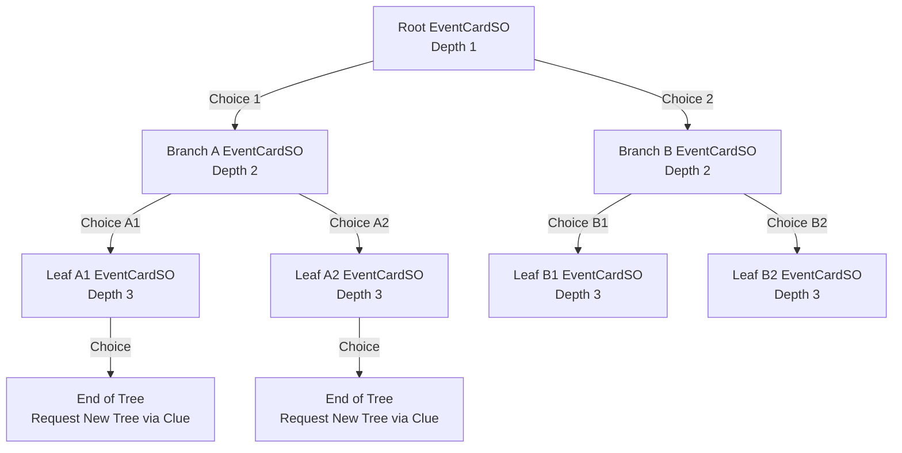
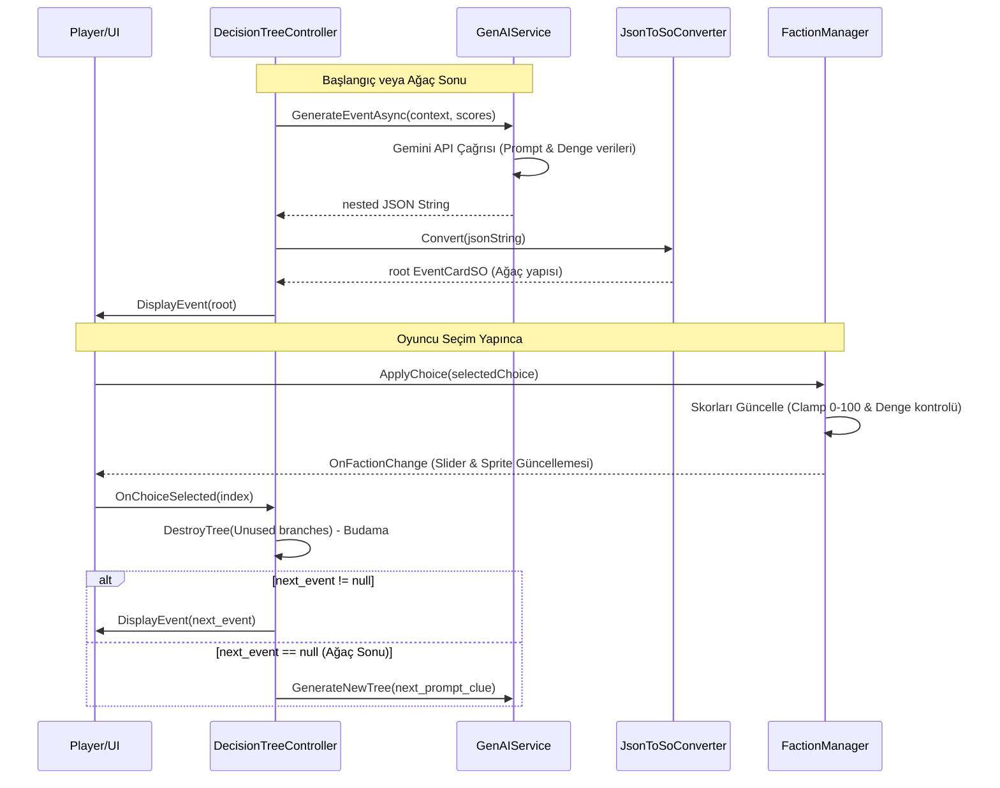

# YapayDenge: Ajanlar ve Karar Ağacı Mimarisi (AGENTS.md)

Bu belge, **YapayDenge** projesindeki yapay zeka (GenAI) entegrasyonunu, karar ağacı mimarisini, sistem bileşenlerini ve bu bileşenlerin birbirleriyle olan etkileşimlerini açıklamak amacıyla hazırlanmıştır.

---

## 🎮 Proje Hakkında Genel Bakış

**YapayDenge**, oyuncunun bir şehri yönettiği, sürdürülebilirlik ve denge ilkelerini öğretmeyi amaçlayan, dram ve politika tonlarında ciddi (*serious game*) bir Unity oyunudur. Oyunda üç temel unsurun (Faction) dengede tutulması gerekir:
1. **Ekonomi (Economy)**
2. **Çevre (Environment)**
3. **Halk/Toplum (Society)**

### ⚖️ Denge ve Oyun Sonu Kuralları
* Her unsur **0 ile 100** arasında bir değere sahiptir (Başlangıç değerleri varsayılan olarak **50**'dir).
* **Game Over (Oyun Bitti)** koşulları:
  * Herhangi bir unsurun değerinin **0 veya daha altına** düşmesi.
---

## 🤖 Sistem Bileşenleri ve Ajanlar

Projede yapay zeka süreçlerini yöneten, verileri işleyen ve görselleştiren temel sınıflar ve görevleri aşağıda açıklanmıştır:

### 1. `GenAIService`
* **Görevi:** Gemini API (`gemini-3.1-flash-lite`) ile doğrudan iletişim kurarak oyunun gidişatına göre dinamik kararlar/olaylar üretir.
* **Nasıl Çalışır?** 
  * Mevcut durum verilerini (Ekonomi, Çevre, Halk değerleri) ve önceki olayların bağlamını (`context`) girdi alan özel bir prompt hazırlar.
  * API'den **3 derinliğinde iç içe geçmiş (nested) bir JSON karar ağacı** talep eder.
  * API yanıtını temizler (markdown işaretlerini kaldırır) ve JSON dizesi olarak döndürür.
  * Bağlantı hataları veya limit aşımı durumunda `MAX_RETRIES = 3` kadar tekrar dener; başarısız olursa güvenli bir **Fallback JSON** yapısı yükler.

### 2. `JsonToSoConverter`
* **Görevi:** `GenAIService` tarafından dönüştürülen JSON karar ağacını, Unity'nin yerel `ScriptableObject` yapılarına dönüştürür.
* **Nasıl Çalışır?**
  * `EventResponseDTO` ve `ChoiceDTO` yardımcı sınıflarını kullanarak JSON'ı deserialize eder.
  * Unity'nin ana iş parçacığında (Main Thread) `ScriptableObject.CreateInstance<EventCardSO>()` metodunu kullanarak dinamik olarak `EventCardSO` nesneleri üretir.
  * Karar ağacının alt dallarını özyinelemeli (recursive) olarak işler ve tüm ağacı bellekte inşa eder.

### 3. `DecisionTreeController`
* **Görevi:** Karar ağacının çalışma zamanındaki durumunu ve yaşam döngüsünü yöneten ana kontrolcü ajandır.
* **Nasıl Çalışır?**
  * Başlangıçta ve ağacın sonuna gelindiğinde `GenAIService` aracılığıyla API'den yeni bir ağaç talep eder (`FetchNewTree`).
  * Oyuncunun yaptığı seçime göre ağacın aktif düğümünü (`currentEventCard`) günceller.
  * **Bellek Yönetimi (Budama / Pruning):** Dinamik oluşturulan Scriptable Object'lerin hafıza sızıntısına (Memory Leak) yol açmaması için oyuncunun seçmediği tüm dalları ve bunların alt düğümlerini özyinelemeli olarak bellekten siler (`DestroyTree` metodu ile `DestroyImmediate` çağrısı yapar).
  * Ağacın en ucuna (yaprak düğüm) ulaşıldığında, son seçimin `next_prompt_clue` (ipucu) parametresini kullanarak yeni bir 3 derinlikli karar ağacı oluşturulması için API'ye istek atar.

### 4. `FactionManager`
* **Görevi:** Şehrin ekonomi, çevre ve toplum skorlarını saklar, günceller ve denge durumunu kontrol eder.
* **Nasıl Çalışır?**
  * Başlangıç değerlerini isteğe bağlı olarak bir `FactionDataSO` dosyasından alabilir.
  * Seçilen kararın etkilerini (`economy_impact`, `environment_impact`, `society_impact`) mevcut puanlara uygular.
  * Puanları `[0, 100]` aralığına kenetler (`Mathf.Clamp`).
  * Oyun sonu koşullarını kontrol eder. Puanlar değiştiğinde `OnFactionChange` event'ini tetikler.

### 5. `UIManager`
* **Görevi:** Olayların başlıklarını, açıklamalarını ve seçim butonlarını ekranda gösterir. Faction durumlarını slider'lar vasıtasıyla günceller.
* **Nasıl Çalışır?**
  * `FactionManager.OnFactionChange` event'ine abone olarak slider değerlerini güncel tutar.
  * `DisplayEvent` metodu ile gelen `EventCardSO` verisine göre UI panellerini doldurur ve butonları dinamik olarak üretir.
  * Oyuncu bir seçeneğe tıkladığında seçimin endeksini `OnChoiceSelected` event'i ile `DecisionTreeController`'a bildirir.

### 6. `CityVisualizer`
* **Görevi:** Şehrin durumunu görsel sprite'lar üzerinden oyuncuya yansıtır.
* **Nasıl Çalışır?**
  * Her bir faction için 3 farklı durum sprite'ı (`badState`: 0-30, `normalState`: 31-70, `goodState`: 71-100) barındırır.
  * `FactionManager.OnFactionChange` event'ini dinleyerek şehrin durumuna göre sprite'ları dinamik olarak günceller.

---

## 🌲 Karar Ağacı Yapısı ve JSON Şeması

Aşağıdaki diyagramda yapay zekanın tek seferde ürettiği 3 derinlikli karar ağacı ve düğümler arasındaki bağlantı gösterilmektedir:



### JSON Şeması Örneği
API'den dönen ve `JsonToSoConverter` tarafından okunan nested JSON yapısı şu şekildedir:

```json
{
  "event_id": "KRIZ_001",
  "title": "Enerji Krizi",
  "description": "Şehrin ana güç şebekesi aşırı yüklenmeden dolayı çökmek üzere.",
  "choices": [
    {
      "text": "Kömür Santralini Aç",
      "economy_impact": 15,
      "environment_impact": -20,
      "society_impact": 5,
      "next_prompt_clue": "Hava kirliliği halkı rahatsız etmeye başladı.",
      "next_event": {
        "event_id": "KRIZ_001_A",
        "title": "Hava Kirliliği Artışı",
        "description": "Kömür santrali çalışıyor fakat şehir merkezini duman kapladı.",
        "choices": [
          {
            "text": "Filtre Tak",
            "economy_impact": -10,
            "environment_impact": 10,
            "society_impact": 5,
            "next_prompt_clue": "Filtre bütçesi ekonomiyi sarstı.",
            "next_event": null
          }
        ]
      }
    }
  ]
}
```

---

## 🔄 Bilgi Akışı ve Yaşam Döngüsü



---

> [!NOTE]
> Bu mimari, her seçim için tek tek API'ye gitmek yerine 3 adımdan oluşan bir mini-hikaye ağacını tek seferde çekerek hem API çağrı maliyetlerini düşürür hem de oyunun akıcılığını (daha az bekleme süresi) artırır.
> Budama (`DestroyTree`) fonksiyonu, C++ tarzı bellek yönetimine benzer şekilde Unity'nin çöp toplayıcısını yormamak için runtime'da üretilen ScriptableObject verilerini anında temizler.
